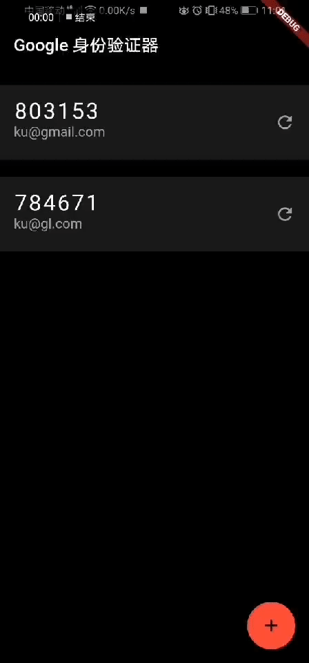

# google-authenticator-flutter

谷歌身份验证器Flutter版

Table of Contents
=================

   * [介绍谷歌验证器](#介绍谷歌验证器)
   * [步骤实现](#步骤实现)
      * [摄像头的帧数据](#摄像头的帧数据)
      * [自定义扫码界面](#自定义扫码界面)
      * [获取二维码信息](#获取二维码信息)
      * [获取数据并存储](#获取数据并存储)
      * [获取校验值](#获取校验值)
      * [页面展示](#页面展示)
   * [实现效果](#实现效果)
   * [扫码体验](#扫码体验)
   * [亟待解决](#亟待解决)

## 介绍谷歌验证器

最近公司使用项目管理gitlab的时候，使用到了两步验证器。所以借着这个机会熟悉一下flutter，就以谷歌身份验证器这个项目来进行实践。

## 步骤实现

以具体的步骤来分析完成。

### 摄像头的帧数据

在[flutter](https://github.com/flutter/plugins)的插件项目中有[camera](https://pub.dev/packages/camera)这个项目，所以直接集成使用即可。

### 自定义扫码界面

* 自定义扫描中间控件

```dart
    canvas.drawRect(Offset.zero & size, rPaint);
    canvas.drawLine(Offset(0, 2), Offset(20, 2), paint);
    canvas.drawLine(Offset(2, 0), Offset(2, 20), paint);
    canvas.drawLine(Offset(size.width, 2), Offset(size.width - 20, 2), paint);
    canvas.drawLine(
        Offset(size.width - 2, 0), Offset(size.width - 2, 20), paint);
    canvas.drawLine(
        Offset(0, size.height - 2), Offset(20, size.height - 2), paint);
    canvas.drawLine(Offset(2, size.height), Offset(2, size.height - 20), paint);
    canvas.drawLine(Offset(size.width - 2, size.height),
        Offset(size.width - 2, size.height - 20), paint);
    canvas.drawLine(Offset(size.width, size.height - 2),
        Offset(size.width - 20, size.height - 2), paint);
```

* 动画展示

```dart
 controller =
        AnimationController(duration: const Duration(seconds: 2), vsync: this);
    animation = Tween(begin: 0.0, end: 200.0).animate(controller)
      ..addListener(() {
        setState(() => {});
      })
      ..addStatusListener((status) {
        if (status == AnimationStatus.completed) {
          controller.reset();
        } else if (status == AnimationStatus.dismissed) {
          controller.forward();
        }
      });
    controller.forward();

```

* 使用`Align`布局添加自定义控件

```dart
   Align(
          alignment: FractionalOffset.center,
          child: ScanView(),
        ),
```

* 使用`Positioned`布局添加中心四周阴影效果

### 获取二维码信息

将帧数据传给端进行解析。以Android为例。

* flutter层进行数据发送与接收

```dart
 static const MethodChannel _channel =
      const MethodChannel('fairy.e.validator/qrcode');
 static Future<String> loadImageBytes({
    List<Uint8List> bytes,
    int imageWidth = 720,
    int imageHeight = 1280,
  }) async {
    return await _channel.invokeMethod(
      'imageStream',
      {
        "cameraBytes": bytes,
        "width": imageWidth,
        "height": imageHeight,
      },
    );
  }
```

* Android层进行数据接收与发送

```java
 MethodChannel channel = new MethodChannel(getFlutterView(), QR_CODE_CHANNEL);
        channel.setMethodCallHandler(
                new MethodChannel.MethodCallHandler() {
                    @Override
                    public void onMethodCall(MethodCall call,MethodChannel.Result result) {
                        switch (call.method) {
                            case QR_CODE_BYTES:
                                runOnFrame((HashMap) call.arguments, result);
                                break;
                            default:
                                result.notImplemented();
                                break;
                        }
                    }
                });

```

* 桢数据转换

```java
      List<byte[]> bytesList = (List<byte[]>) args.get("cameraBytes");
            ByteBuffer Y = ByteBuffer.wrap(bytesList.get(0));
            ByteBuffer U = ByteBuffer.wrap(bytesList.get(1));
            ByteBuffer V = ByteBuffer.wrap(bytesList.get(2));
            int Yb = Y.remaining();
            int Ub = U.remaining();
            int Vb = V.remaining();
            byte[] data = new byte[Yb + Ub + Vb];
            Y.get(data, 0, Yb);
            V.get(data, Yb, Vb);
            U.get(data, Yb + Vb, Ub);
```

* 导入[Zxing](http://repo1.maven.org/maven2/com/google/zxing/core/)库进行解析

```java
  Result rawResult = null;
        PlanarYUVLuminanceSource source = new PlanarYUVLuminanceSource(data, width, height, 0, 0,
                width, height);
        BinaryBitmap bitmap = new BinaryBitmap(new HybridBinarizer(source));
        try {
            rawResult = multiFormatReader.decodeWithState(bitmap);
        } catch (ReaderException e) {
            e.printStackTrace();
        } finally {
            multiFormatReader.reset();
        }
```

### 获取数据并存储

* 依次解析二维码信息

```dart
    Uri uri = Uri.parse(result);
    String period =
        isTotp ? uri.queryParameters['period'] : uri.queryParameters['counter'];
    if (null == period) {
      period = isTotp ? '30' : '1';
    } else if (!isTotp) {
      period = (int.parse(period) + 1).toString();
    }
    String secret = uri.queryParameters["secret"];
    if (null == secret) {
      ToastHelper.showToast(context, 'QR码非法');
      return;
    }
    String path = uri.path;
    if (null == path) {
      ToastHelper.showToast(context, 'QR码非法');
      return;
    }
    path = path.substring(1);
    String issuer = uri.queryParameters["issuer"];
```

* 数据库存储

使用开源存储库[sqflite](https://pub.dev/packages/sqflite)进行数据存储

### 获取校验值

* 算法获取

```dart
 Uint8List keys = base32.decode(secret);
    var hmacSha1 = new Hmac(sha1, keys);
    int time = isTotp ? (currentTimeMillis() / 1000) ~/ 30: int.parse(counter);

    Uint8List data = new Uint8List(8);
    int value = time;
    for (int i = 8; i-- > 0; value >>= 8) {
      data[i] = value;
    }
    Uint8List digest = hmacSha1.convert(data).bytes;
    int offset = digest[20 - 1] & 0xF;
    int truncatedHash = 0;
    for (int i = 0; i < 4; ++i) {
      truncatedHash <<= 8;
      truncatedHash |= (digest[offset + i] & 0xFF);
    }
    truncatedHash &= 0x7FFFFFFF;
    truncatedHash %= 1000000;
    print("结果为${truncatedHash.toString()}");
```

* 值填充

```dart
 static String getNumberHash(String number){
    for(int i=number.length;i<6;i++){
      number="0"+number;
    }
    return number;
  }
```

### 页面展示

* 以`ListTile `控件展示

```dart
    ListTile(
            contentPadding:
                EdgeInsets.symmetric(vertical: 8.0, horizontal: 16.0),
            trailing: data.isTotp ? _totpIcon() : _hotpIcon(data.id),
            title: Text(
              Utils.getNumber(data.secret, data.isTotp, data.period),
              style: styleNumber,
            ),
            subtitle: Text(
              Utils.getPath(data.path, data.issuer),
              style: styleSubtitle,
            ),
            onTap: () => {_hotpTap(data)},
            onLongPress: () => {_show(data)},
          ),
```

* 基于时间动画效果

```dart
    double start = 2 * pi * ((30 - time) / 30);
    controller =
        AnimationController(duration: Duration(seconds: time), vsync: this);
    animation = Tween(begin: start, end: 2 * pi).animate(controller)
      ..addListener(() {
        setState(() => {});
      })
      ..addStatusListener((status) {
        if (status == AnimationStatus.completed) {
          viewListener.onSuccess();
          controllerTotp = AnimationController(
              duration: const Duration(seconds: 30), vsync: this);
          animation = Tween(begin: 0.0, end: 2 * pi).animate(controllerTotp)
            ..addListener(() {
              setState(() => {});
            })
            ..addStatusListener((status) {
              if (status == AnimationStatus.completed) {
                controllerTotp.reset();
                viewListener.onSuccess();
              } else if (status == AnimationStatus.dismissed) {
                controllerTotp.forward();
              }
            });
          controllerTotp.forward();
        } else if (status == AnimationStatus.dismissed) {
          controller.forward();
        }
      });
    controller.forward();
```

* 基于计数器动画效果

以Map存储相关id与Timer。实现点击单个响应单个的效果。

```dart
  if (!valueMap.containsKey(data.id) && !data.isTotp) {
      startCountdownTimer(data.id);
    }
 void startCountdownTimer(id) {
    Timer timer = Timer(new Duration(seconds: 5), () {
      print("倒计时完成");
      setState(() {
        valueMap.remove(id);
      });
    });
    setState(() {
      valueMap[id] = timer;
    });
  }
```

## 实现效果



## 扫码体验


## 亟待解决

ios的数据解析，还有待实现。
